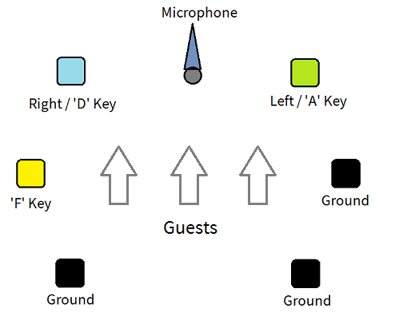

# First Flight
>*First Flight* is a video game with an aerodynamic twist! In the experience, players must become an aeroplane to help ten year old Ben achieve his childhood dream of flying. Airborne players sail through the sky avoiding feisty birds intent on sending Ben’s dreams crashing to the ground!

>Powering the experience is the [Makey Makey](http://makeymakey.com/) wired to six pedestals, three on each side. The direction of flight depends on the pedestals in contact. Players form the wings of the aeroplane as a human chain, orienting the chain in the direction they want to fly. Connecting the first pedestal on the left and the last pedestal on the right, flies the plane right. Vice versa flies the plane left.

>So hold onto your partners and strap yourselves in for some co-op fun, with a soaring ride in First Flight!

Watch the video here: [Youtube Link](https://www.youtube.com/watch?v=aBNrcFFF1Y8)

### The team
First flight was created as part of the Building Virtual Worlds class at Entertainment Technology Center, Carnegie Mellon University. This world was featured in the BVW Festival 2015.

**Team members:**

Kanishk Chhibber - Programmer  
Nikhil Kashyap - Sound  
Jiawei (Candice) Li - Artist  
Abhishek Singh - Programmer  
Yiheng Zhu - Artist

### Project code
The world was built using Unity engine and the complete Unity project has been provided here. Please note that this project was created using rapid prototyping over a two-week period and has not been revisited after the showcase. 

The code is provided is *'as-is'* and it lacks documentation. This might been cleaned up at some point in the future, but all the team members are currently invested in other projects that are a higher priority.

### General instructions
1. Unity Personal edition is free to use and may be downloaded by [clicking here](https://store.unity.com/download?ref=personal).
2. The project was created on an older version of Unity but it should automatically update the project the first time you open it.
3. All the relevant files are available under the 'Resources' folder. These have been segregated into different sections like art essets, sound, scripts etc.
4. The game utilizes a microphone for audio input that determines the acceleration of the plane. As long as a single microphone is connected to the system, the game should run fine. In case of multiple devices, you can use the *config.ini* file in the root folder 'FirstFlight' to manipulate the device to be chosen.
5. For the wings, six pedestals (Makey Makey inputs) need to be set up in the following fashion:

  * The default position is for three players to hold hands and touch the central two pedestals. This activates 'F' as the input from the Makey Makey and keeps the plane level.
  * On touching the diagonal pedestals by simulating the wing of a plane, the Makey Makey inputs left/right which is converted to a simple analog input within Unity.

### License
